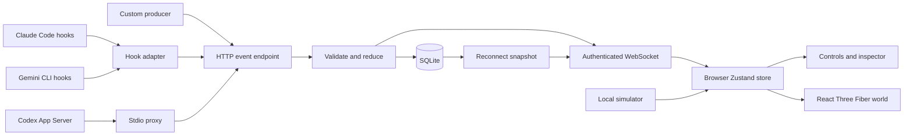

# Architecture

## System boundaries

Agentarium has a static browser application and a separate local Node.js bridge. Provider integrations observe lifecycle messages and normalize them into a shared event schema. The bridge validates and persists those events; the browser renders their reduced state.

Simulation and live activity are separate modes. Changing mode replaces the browser's resident list and clears selection, activity, and deduplication memory. Demo commands cannot mutate live residents.

## Source ownership

| Source                                                | Responsibility                                                          |
| ----------------------------------------------------- | ----------------------------------------------------------------------- |
| [main.tsx](../src/main.tsx)                           | Browser entry point                                                     |
| [App.tsx](../src/App.tsx)                             | Layout, controls, dialogs, inspector, audio, and world loading boundary |
| [World.tsx](../src/World.tsx)                         | Scene, residents, animation, labels, lighting, and camera               |
| [world/layout.ts](../src/world/layout.ts)             | Island/zone bounds, seat positions, and camera presets                  |
| [world/Environment.tsx](../src/world/Environment.tsx) | Modular zone scenery and café art                                       |
| [world/DetailLayer.tsx](../src/world/DetailLayer.tsx) | Camera/quality-based decorative detail mounting                         |
| [world/motion.ts](../src/world/motion.ts)             | Reversible resident routes and lifecycle motion                         |
| [world/rig.ts](../src/world/rig.ts)                   | Authored character poses and keyboard alignment                         |
| [state.ts](../src/state.ts)                           | Zustand state, simulator, live ingestion, and UI settings               |
| [sessions.ts](../src/sessions.ts)                     | Session grouping and compatibility with older snapshots                 |
| [bridge.ts](../src/bridge.ts)                         | Browser connection, authentication, snapshots, and reconnection         |
| [protocol.mjs](../src/shared/protocol.mjs)            | Runtime event validation and deterministic agent reduction              |
| [protocol.d.mts](../src/shared/protocol.d.mts)        | Type declarations for the shared JavaScript module                      |
| [webmcp.ts](../src/webmcp.ts)                         | Optional browser tool registration                                      |
| [discovery.mjs](../bridge/discovery.mjs)              | Opt-in read-only local provider history readers                         |
| [live.mjs](../src/shared/live.mjs)                    | Merge telemetry/history and assign stable latest-eight seats            |
| [server.mjs](../bridge/server.mjs)                    | Loopback HTTP/WebSocket service and SQLite persistence                  |
| [adapters.mjs](../bridge/adapters.mjs)                | Provider normalization and HTTP delivery                                |
| [hook.mjs](../bridge/hook.mjs)                        | Provider hook stdin/stdout wrapper                                      |
| [codex-proxy.mjs](../bridge/codex-proxy.mjs)          | Transparent App Server stdio forwarding and telemetry                   |
| [style.css](../src/style.css)                         | Application layout and responsive styling                               |

React owns the interface; React Three Fiber connects React components to Three.js. Drei supplies scene helpers and animation utilities. Zustand is the browser state store. The bridge uses Node HTTP, `ws`, and built-in SQLite. There is no separate application backend for provider task execution.

## Live event flow

1. A provider adapter creates a metadata-only event.
2. The adapter posts it with the bridge token to `/events`.
3. The bridge validates the event, checks persisted IDs and per-agent sequence ordering, and computes the next snapshot.
4. A SQLite transaction writes the event and changed agent, then prunes old event rows.
5. The bridge broadcasts the accepted event to authenticated browser connections.
6. The browser uses the shared reducer and updates the interface and world.

On connection, a full snapshot replaces browser agent state. The browser does not request historical activity: its feed contains events observed during the current connection/mode, not a replay of SQLite's event table.

## Optional browser tools

When `document.modelContext.registerTool` is available, the app registers `grove_list_agents`, `grove_spawn_demo_task`, `grove_set_demo_status`, and `grove_change_view`. Registration is feature-detected and cleaned up with an abort signal. Unsupported browsers still run the application normally.

These tools operate on the same Zustand state as the UI. Demo mutation tools reject live mode. They do not launch provider jobs, and this feature is not a network MCP server.

## Persistence boundaries

SQLite stores live agent snapshots and a bounded event log. UI preferences, selection, simulation state, connection credentials, and the browser activity feed are not persisted. The GLB character model ships as a static asset; interface fonts currently load from Google Fonts.

## Local-history path

Authenticated viewers enable discovery on the bridge. Bounded scans run approximately every five seconds while viewers are connected. Discovered metadata is merged with persisted telemetry, then broadcast as a `sessions` snapshot. Discovery does not write provider storage, launch models, or synthesize hook events. The browser projects the collection into eight stable session seats. See [Local session discovery](local-discovery.md).

## World rendering boundary

The expanded island has four zones and eight seats. Only decorative children belong to camera-aware detail layers; residents, bridge ingestion, session selection, and freshness handling stay outside them. Panning or zooming never pauses agent tracking. The finite world loads together, with individual offscreen meshes culled by Three.js and fine decorations conditionally mounted. There is no chunk loader or background terrain generation. See [World layout and rendering](world-layout.md).

Ambient effects in `world/Ambience.tsx` use mutable Three.js objects and do not subscribe to session activity. `world/ambient.ts` contains bounded animation stepping, leaf positions, and frame-statistic calculations. `world/RenderStats.tsx` is opt-in via `?renderStats=1` and publishes only a local diagnostic overlay, with no bridge or analytics transmission.
